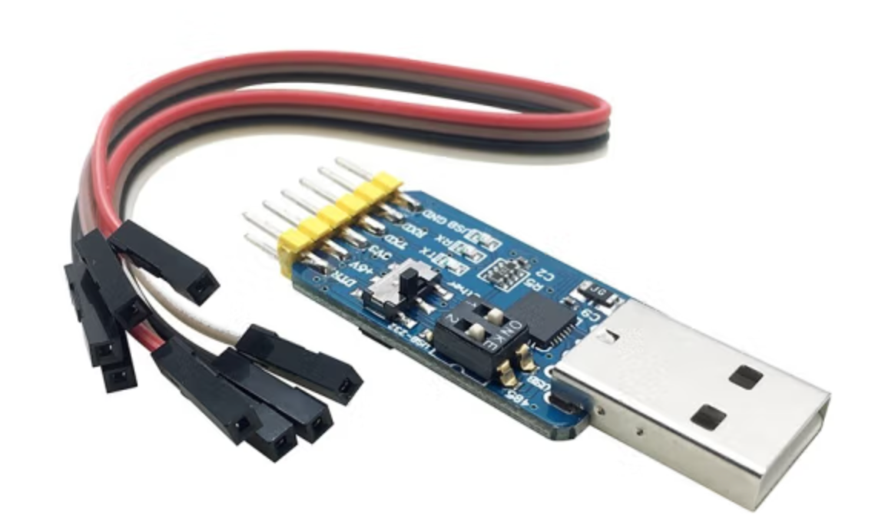

# Chapter1 串口调试配置

## 目录

- [Chapter1 串口调试配置](#chapter1-串口调试配置)
  - [目录](#目录)
  - [macOS 13.0.1 串口调试配置](#macos-1301-串口调试配置)
    - [实验所需工具](#实验所需工具)
    - [下载串口驱动](#下载串口驱动)
    - [通过串口连接板子](#通过串口连接板子)
    - [其它推荐](#其它推荐)

## macOS 13.0.1 串口调试配置

**目的**:通过macOS连接到开发板，执行相关指令。

### 实验所需工具

1. MacBook Pro macOS 13.0.1（一台）

2. 华山派risc-v 64开发板（1块）

3. USB 转 TTL 串口工具（1个）

4. Type-C扩展坞（1根）

5. TYPE C 接口电源线（1根）

|设备名| 图例 |
|---|---|
| 华山派risc-v 64开发板 | |
| USB 转 TTL 串口工具：通过串口连接到开发板 ||
|Type-C扩展坞：用于将USB和网口转化为Type C，接入macOS| |

### 下载串口驱动

下载地址: <https://www.prolific.com.tw/US/ShowProduct.aspx?p_id=229&pcid=41>

解压、安装PL2303HXD_G_Mac Driver_v2_1_0_20210311.zip后重启电脑

### 通过串口连接板子

1.  将板子与电脑连接
    
    > 开发板的**TX**连串口工具的**RX**，开发板的**RX**连串口工具的**TX**

2.  查看串口设备信息

    ```shell
    ls /dev/ | grep usb
    cu.usbserial-14310
    tty.usbserial-14310 #此设备,注意,名称可能会有所不同
    ```
3.  使用串口终端工具screen连接板子
    
    ```shell
    #screen连接
    screen /dev/tty.usbserial-14310 115200
    #连接成功后进入系统
    [root@cvitek]~#
    #备注: 系统密码为cvitek
    ```

### 其它推荐

串口调试助手: 一款图形化串口调试工具，通过app store安装